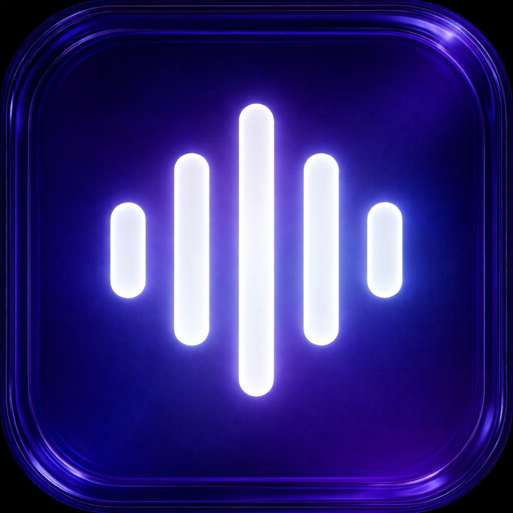

  

<h1 align="center">OpenFlow</h1>

  Free and open source alternative to <a href="https://wisprflow.ai">Wispr Flow</a>, <a href="https://superwhisper.com">Superwhisper</a>, and <a href="https://monologue.to">Monologue</a>.

  <a href="https://github.com/Vraj1234/freeflow/releases/latest/download/OpenFlow.dmg"><b>⬇ Download OpenFlow.dmg</b></a> 
  Works on all Macs (Apple Silicon + Intel)

---

> **OpenFlow** is a fork of [zachlatta/freeflow](https://github.com/zachlatta/freeflow) by [Vraj1234](https://github.com/Vraj1234) with the following changes:
> - Screen capture and context-awareness LLM calls are disabled — Groq only receives your voice recordings
> - Renamed and rebranded as OpenFlow

---

  

I like the concept of apps like [Wispr Flow](https://wisprflow.ai/), [Superwhisper](https://superwhisper.com/), and [Monologue](https://www.monologue.to/) that use AI to add accurate and easy-to-use transcription to your computer, but they all charge fees of ~$10/month when the underlying AI models are free to use or cost pennies.

OpenFlow is a free, open source version. Here's how it works:

1. Download the app from above or [click here](https://github.com/Vraj1234/freeflow/releases/latest/download/OpenFlow.dmg)
2. Get a free Groq API key from [groq.com](https://groq.com/)
3. Hold `Fn` to talk, or tap `Command-Fn` to start and stop dictation, and have whatever you say pasted into the current text field

You can also customize both shortcuts. If your toggle shortcut extends your hold shortcut, you can start in hold mode and press the extra modifier keys to latch into tap mode without stopping the recording.

There's no OpenFlow server, so no data is stored or retained — the only information that leaves your computer is the audio sent to Groq's transcription API and your transcript sent to Groq's LLM API for post-processing (cleaning up punctuation, grammar, and spelling).

If you'd rather keep cleanup more literal and less context-aware, you can paste this simpler prompt into the custom system prompt setting:

  
Simple post-processing prompt

  <pre><code>You are a dictation post-processor. You receive raw speech-to-text output and return clean text ready to be typed into an application.

Your job:
- Remove filler words (um, uh, you know, like) unless they carry meaning.
- Fix spelling, grammar, and punctuation errors.
- When the transcript already contains a word that is a close misspelling of a name or term from the context or custom vocabulary, correct the spelling. Never insert names or terms from context that the speaker did not say.
- Preserve the speaker's intent, tone, and meaning exactly.

Output rules:
- Return ONLY the cleaned transcript text, nothing else. So NEVER output words like "Here is the cleaned transcript text:"
- If the transcription is empty, return exactly: EMPTY
- Do not add words, names, or content that are not in the transcription. The context is only for correcting spelling of words already spoken.
- Do not change the meaning of what was said.

Example:
RAW_TRANSCRIPTION: "hey um so i just wanted to like follow up on the meating from yesterday i think we should definately move the dedline to next friday becuz the desine team still needs more time to finish the mock ups and um yeah let me know if that works for you ok thanks"

Then your response would be ONLY the cleaned up text, so here your response is ONLY:
"Hey, I just wanted to follow up on the meeting from yesterday. I think we should definitely move the deadline to next Friday because the design team still needs more time to finish the mockups. Let me know if that works for you. Thanks."</code></pre>

### FAQ

**Why does this use Groq instead of a local transcription model?**

Local models are great in theory, but to get post-processing (correctly spelled names, proper punctuation), you need a local LLM too. The total pipeline then takes 5–10 seconds per transcription instead of under 1 second, and battery life takes a hit.

You can use a custom model with OpenFlow by configuring the LLM API URL in the OpenFlow settings to use Ollama.

## License

Licensed under the MIT license.
